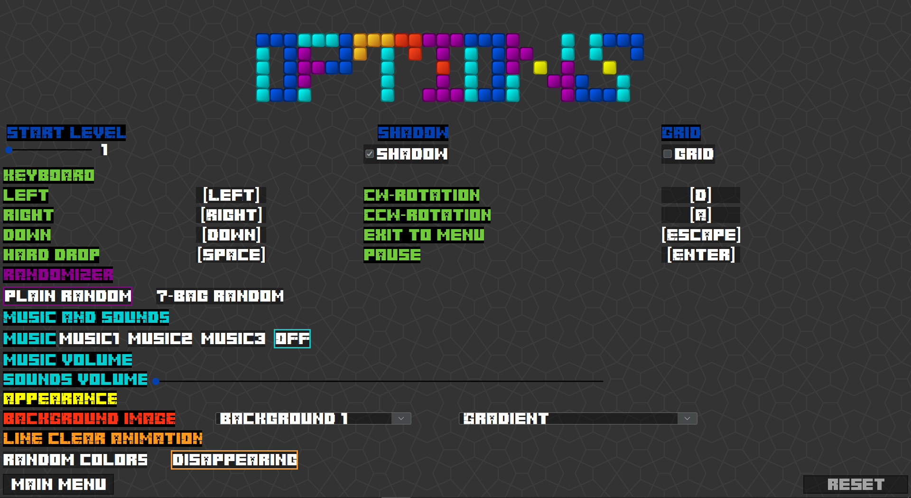
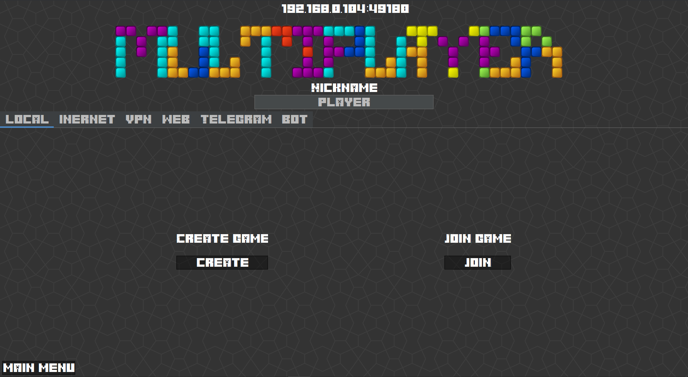

# Tetris
 
This project is implemented in Java.

Tetris has audio provided by the [AudioCue](https://github.com/philfrei/AudioCue).

Tetris has several game modes.
Single game and multiplayer game.

# Preview video
https://user-images.githubusercontent.com/55970161/163380204-155f0b48-91d5-42c7-9092-55be4e4e775b.mp4

 

*click on the picture to visi telegram bot*

# Multiplayer
- [x]  LOCAL –  P2P game over LAN (player and his opponent must be connected to the same LAN)
- [x] VPN –  P2P game by simulating a local network, using, for example, hamachi (two players first create a virtual private network, and then connect in Tetris itself)
- [x] INTERNET –  P2P game using a technology called UDP hole punching and STUN, through which players can be connected to different networks
- [x] WEB – game using the [web server](https://github.com/vitaliysheshkoff/tetris_server), which is an intermediary between two players (The player first creates a room to which his opponent later connects by entering the number of the created room)
- [x] TELEGRAM – by pressing the "telegram request" button, the player sends a request for the game to the [telegram bot](https://t.me/tetris_game_tetris_bot), any member of this bot can accept the request. After accepting the request, the Tetris application will be automatically opened. Works only after installation on Windows OS.  (The game is the same as the WEB)
- [x] BOT – you can play against the AI 

# Screenshots
 
 ## Menu
 
 
 ## Play process
 
 
  ## Leaderboard
 
 
  ## Settings
 
  
  ## Multiplayer
 
 
 > waiting for an opponent 
 
 
 > playing with an opponent
  

  # Download
- [installer](https://github.com/vitaliysheshkoff/Tetris-Multiplayer/blob/resize_network_multiplayer_branch/out/artifacts/Tetris_Multiplayer_jar/installer/tetrisSetup.exe) for Windows OS
- [exe](https://github.com/vitaliysheshkoff/Tetris-Multiplayer/blob/resize_network_multiplayer_branch/out/artifacts/Tetris_Multiplayer_jar/tetris.exe)
- [jar](https://github.com/vitaliysheshkoff/Tetris-Multiplayer/blob/resize_network_multiplayer_branch/out/artifacts/Tetris_Multiplayer_jar/Tetris-Multiplayer.jar)
